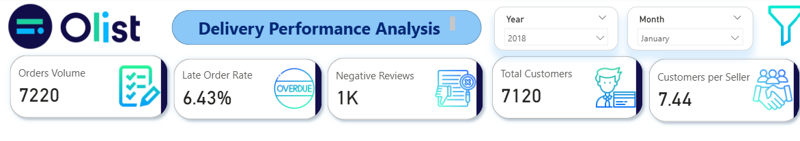
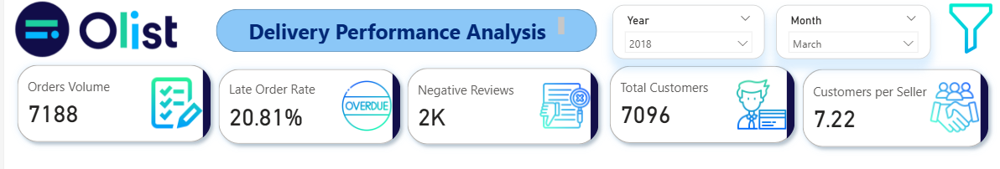

# Olist Delivery Performance Analysis

Why did late deliveries get worse in 2018, even though the business grew? This project finds out — and shows where to fix it first.

## Executive Summary

Using MySQL and Power BI, I analyzed 2017–2018 Olist marketplace data to uncover the drivers of late deliveries, seasonal delay patterns, and the routes and sellers most responsible for delivery risk. Order volume grew from ~40K to ~59K between 2017 and 2018, but the late-order rate rose from 6.22% to 9.13% and negative reviews nearly doubled from ~4K to ~9K. Volume growth alone does not explain the decline — several low-volume months performed far worse than high-volume ones — pointing instead to route- and seller-specific breakdowns, concentrated in shipments from São Paulo sellers into distant states such as AL, MA, and CE.

## Business Problem

The business needs to understand why delivery performance declined in 2018 even as the platform grew, and where to focus operational improvements first. Late orders and negative reviews both increased year-over-year, and the drivers behind that decline were not yet understood. This analysis answers three questions:

Is the rise in late deliveries explained by order volume growth, or by something else? Which months, routes, sellers, and customer states are most responsible for late deliveries? What operational recommendation would most directly reduce delivery risk going forward?

## Technical Skills Demonstrated

**SQL (MySQL)**
- Data cleaning & validation: fixed inconsistent/misspelled city names across 50+ variants, removed duplicate and orphaned records, filled gaps in category translations
- `ROW_NUMBER()` window functions for deduplication
- `JOIN`, `LEFT JOIN`, `NOT EXISTS` for referential integrity checks (e.g., orphaned reviews, unmatched cities)
- `CASE` statements for bulk data standardization
- Aggregation with `GROUP BY` / `HAVING` to build review-scoring and delivery-flag tables

**Power BI / DAX**
-Star-schema data model: fact_orders connected to `dim_customers`, `dim_sellers`, `dim_product`, `dim_geolocation`, `dim_order_state`, and `date`
-Custom measure table with DAX measures including % Late Orders, Avg Delivery Days, Avg Handoff Days, and Avg Transit Days
-KPI cards, dynamic Year/Month filtering, and drill-down visuals (routes, seller cities, product categories, customer states)
-Iterative dashboard design based on review cycles — refining chart types, labels, and titles to keep every visual tied to a specific business question

**Data Model**

Star schema built in Power BI:

fact_orders — grain: order/order-item level, with delivery flags (Is Late, Is_Late-alpha), Delay Days, Carrier Transit Days, freight_value, and keys to all dimensions and more..
dim_customers — customer_key, customer_city, customer_state, customer_unique_id, customer_zip_code_prefix
dim_sellers — seller_key, seller_city, seller_state, seller_zip_code_prefix
dim_geolocation — geolocation_city, geolocation_state, geolocation_lat/lng, zip_code_prefix
dim_product — product_id, product_category_name, product_category_name_english
dim_order_state — key_order_state, order_status
date — Date, month, year
measure — standalone table holding DAX measures: % Late Orders, Avg Delivery Days, Avg Handoff Days, Avg Transit Days


## Key Numbers (2017 vs 2018)

| Metric | 2017 | 2018 | Change |
|---|---|---|---|
| Orders | ~40K | ~59K | +19K |
| Late-order rate | 6.22% | 9.13% | +2.9 pts |
| Negative reviews | ~4K | ~9K | +5K |
| Customers per seller | 23.21 | 23.87 | +0.66 |
| Avg carrier transit days | 27 | 25 | -2 days |

## What I Found

1. **Volume isn't the cause.** January 2018 had more orders than March 2018 (7,220 vs 7,188) but a much lower late rate (6.43% vs 20.81%). So something else is driving the delays.
<table>
  <tr>
    <td width="50%"></td>
    <td width="50%"></td>
  </tr>
</table>

3. **2018 got unpredictable.** In 2017, late orders followed a normal seasonal pattern (one peak, November). In 2018, spikes happened all over the calendar — Feb, May, Aug, and a big one in March (1,496 late orders) — which points to operational problems, not just seasonal demand.
4. **March's spike traces to one route.** SP → CE hit a 53% late rate that month, caused by one seller's performance dropping sharply. That pushed CE's customer late rate to 51% — the worst of any state.
5. **In-state delivery works fine. Cross-state doesn't.** SP → SP is only 6.78% late. But SP → AL is 23%, SP → CE is 19%, and PR → BA is 18%. Almost all sellers are based in SP, while the worst-performing states (AL, MA, CE) barely have any local sellers.
6. **Carrier transit time isn't the main issue.** It only dropped slightly (27 → 25 days), too small to explain the late-rate increase.

## Recommendations

1. **Recruit local sellers in AL, MA, and CE.** Shorter shipping distance should bring their late rates down toward the 6–7% seen on in-state routes.
2. **Start with CE.** It had the clearest breakdown (SP → CE at 53% late) and the most obvious fix — a good pilot before expanding elsewhere.
3. **Treat 2018 spikes as one-off operational failures, not capacity problems.** Investigate specific sellers/routes during peak months instead of assuming it's just "too many orders."

## Still to Investigate

- Is the cross-state problem really about *local sellers*, or just *distance*? Comparing nearby-but-different-state routes would clarify this.
- MA's numbers are based on just 1 seller and 389 orders — worth re-checking as more sellers join.
- No dollar/revenue impact estimate yet for the seller-recruitment recommendation.

## Data Model (Power BI)

Star schema: `fact_orders` connects to `dim_customers`, `dim_sellers`, `dim_product`, `dim_geolocation`, `dim_order_state`, and `date`, plus a separate `measure` table for DAX measures (% Late Orders, Avg Delivery/Handoff/Transit Days).

## Repo Structure

```
├── README.md
├── images/        → dashboard screenshots
├── sql/           → data cleaning script
├── powerbi/       → .pbix file
└── data/          → Olist dataset
```

## Author
[Your name]
